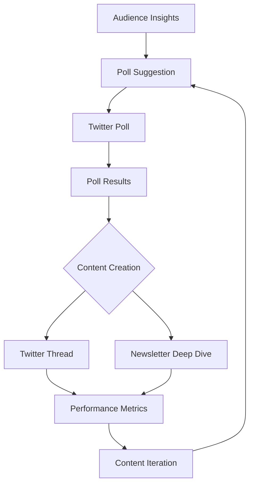

# Interactive Content Workflow

## Workflow Steps

1. **Audience Insights** - Review audience data to understand interests and preferences
2. **Poll Suggestion** - Create poll ideas based on audience insights
3. **Twitter Poll** - Post poll on Twitter to gauge audience interest
4. **Poll Results** - Record and analyze poll results
5. **Content Creation** - Develop content based on poll results
6. **Twitter Thread** - Create and post thread on Twitter
7. **Newsletter Deep Dive** - Expand on thread with deeper analysis
8. **Performance Metrics** - Track and analyze content performance
9. **Content Iteration** - Use insights to improve future content

## Key Files and Locations

- Poll Suggestions: `/polls/suggestions/`
- Poll Results: `/polls/results/`
- Thread Content: `/threads/`
- Newsletter Content: `/newsletters/`
- Performance Metrics: `/metrics/`
- Templates: `/templates/`
